# Sistem Informasi Kehadiran Siswa

## 📋 Deskripsi Singkat Project

**Sistem Informasi Kehadiran Siswa** adalah aplikasi web untuk mengelola dan memantau kehadiran siswa di sekolah. Aplikasi ini memungkinkan admin untuk mencatat kehadiran siswa (hadir, izin, alfa, sakit), mengelola data siswa, melihat laporan kehadiran, dan menganalisis tren kehadiran melalui dashboard dengan visualisasi grafik.

## 🎯 Latar Belakang & Tujuan

Sekolah memerlukan sistem yang efisien untuk mencatat, menyimpan, dan menganalisis data kehadiran siswa. Aplikasi ini dirancang untuk:

- **Mempermudah pencatatan kehadiran** siswa secara digital
- **Menghindari data tercampur** dengan struktur database yang terorganisir
- **Menyediakan insight kehadiran** melalui dashboard dan laporan
- **Memudahkan manajemen data siswa** (CRUD + import bulk via CSV)
- **Menganalisis tren kehadiran** dengan grafik bulanan dan per-kelas
- **Mencetak/mengekspor laporan** kehadiran untuk keperluan administratif

## ⭐ Fitur Utama Aplikasi

### 1. **Dashboard**

- Tampilkan statistik kehadiran hari ini (pie chart: hadir, izin, alfa, sakit)
- Grafik batang kehadiran bulanan (1 bulan penuh) dengan status harian
- Penandaan otomatis hari libur (Minggu) dengan warna berbeda
- Kartu per-kelas yang menampilkan persentase kehadiran dan detail status
- Chart responsif menggunakan Chart.js

### 2. **Manajemen Data Siswa**

- **CRUD Lengkap**: Tambah, lihat, edit, hapus data siswa
- **Import Bulk**: Upload CSV untuk menambah/update siswa secara massal
- **Template CSV**: Download template CSV siap pakai
- **Filter & Pencarian**: Cari siswa berdasarkan nama atau NISN
- **Per-Class View**: Lihat siswa berdasarkan kelas
- Paginasi otomatis dengan nomor urut berkelanjutan

### 3. **Pencatatan Kehadiran**

- Pilih kelas dan tanggal untuk mencatat kehadiran
- Tandai status siswa: **Hadir**, **Izin**, **Alfa**, **Sakit**
- Hindari pencatatan pada hari Minggu (sistem otomatis menonaktifkan)
- Pencatatan per-siswa dengan daftar kelas tertentu
- Notifikasi sukses setelah disimpan

### 4. **Rekapan Kehadiran**

- Tabel rekapan dengan filter berdasarkan tanggal dan kelas
- Hitung statistik kehadiran per siswa dalam periode tertentu
- **Export ke Excel**: Download rekapan dalam format `.xlsx`
- **Cetak PDF**: Cetak langsung dari browser
- Tampilkan total hadir, izin, alfa, sakit per siswa

### 5. **Autentikasi & Profil**

- Manajemen profil pengguna (ubah nama, password)
- Logout aman dengan session terkelola

## 🖼️ Tampilan Aplikasi

Berikut adalah screenshot tampilan aplikasi:

### Halaman Login


Halaman login dengan form username dan password untuk autentikasi pengguna.

### Dashboard - Statistik

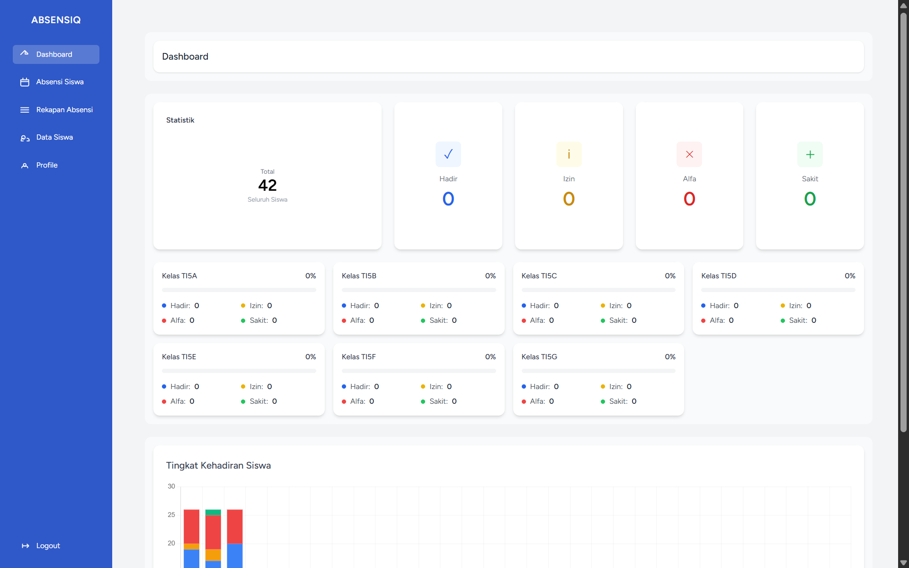

Dashboard utama menampilkan pie chart kehadiran hari ini, kartu statistik per-kelas, dan ringkasan total siswa.

### Dashboard - Grafik Kehadiran Bulanan

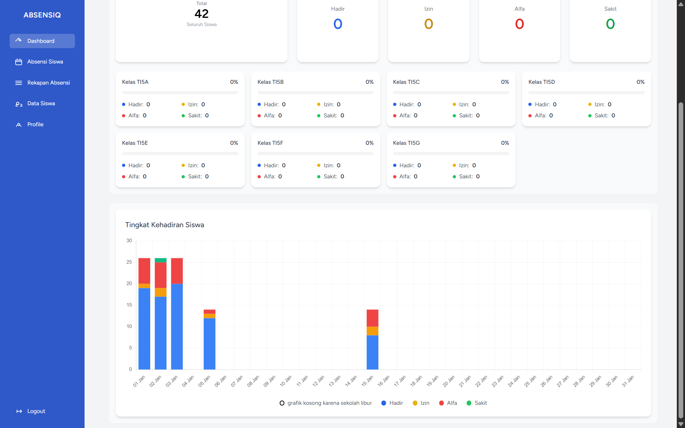

Grafik batang yang menampilkan tren kehadiran selama satu bulan penuh, dengan hari libur ditandai dengan grafik kosong.

### Halaman Data Siswa - Daftar

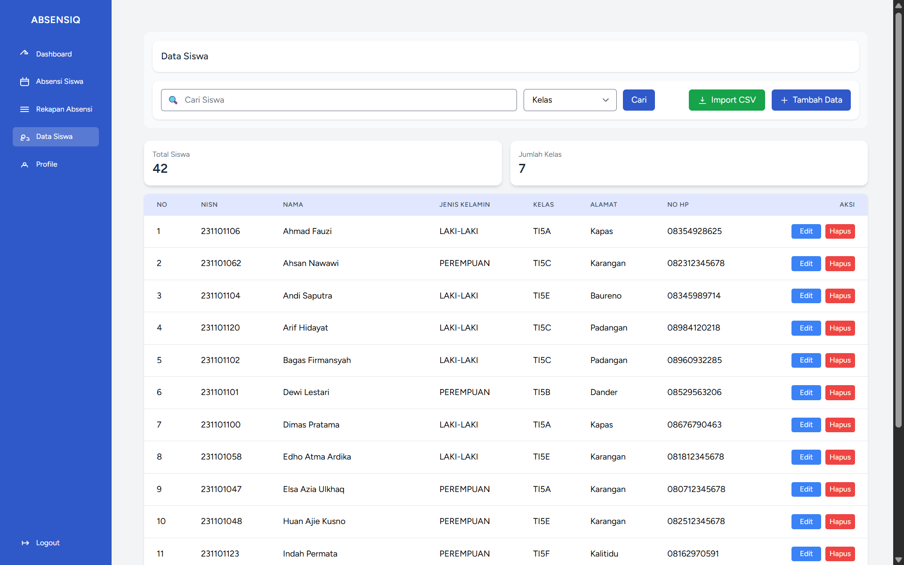

Tabel daftar siswa dengan fitur pencarian, filter per-kelas, dan opsi edit/hapus.

### Halaman Data Siswa - Tambah/Edit

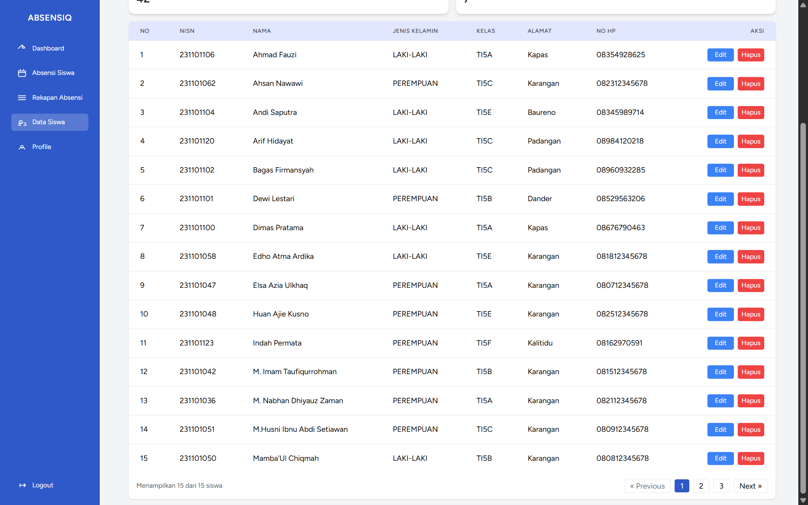

Form untuk menambah atau mengedit data siswa (NISN, nama, jenis kelamin, kelas, alamat, nomor HP).

### Halaman Pencatatan Kehadiran

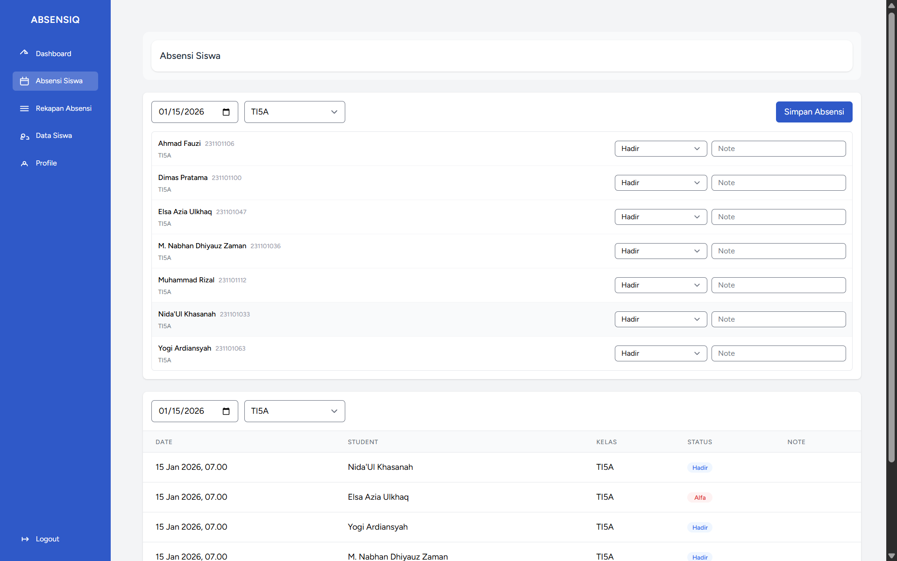

Interface pencatatan kehadiran dengan dropdown kelas, date picker, dan daftar siswa yang dapat ditandai statusnya.

### Halaman Pencatatan Kehadiran - Daftar Siswa

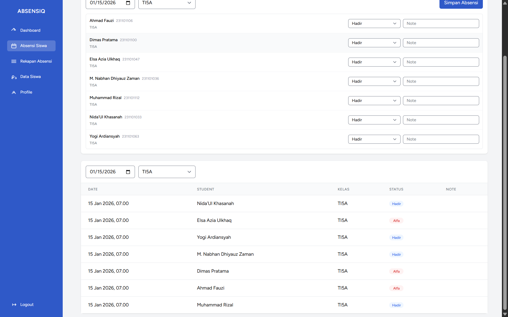

Daftar siswa dengan tombol untuk memilih status kehadiran (hadir, izin, alfa, sakit).

### Halaman Pencatatan Kehadiran - Detail Siswa

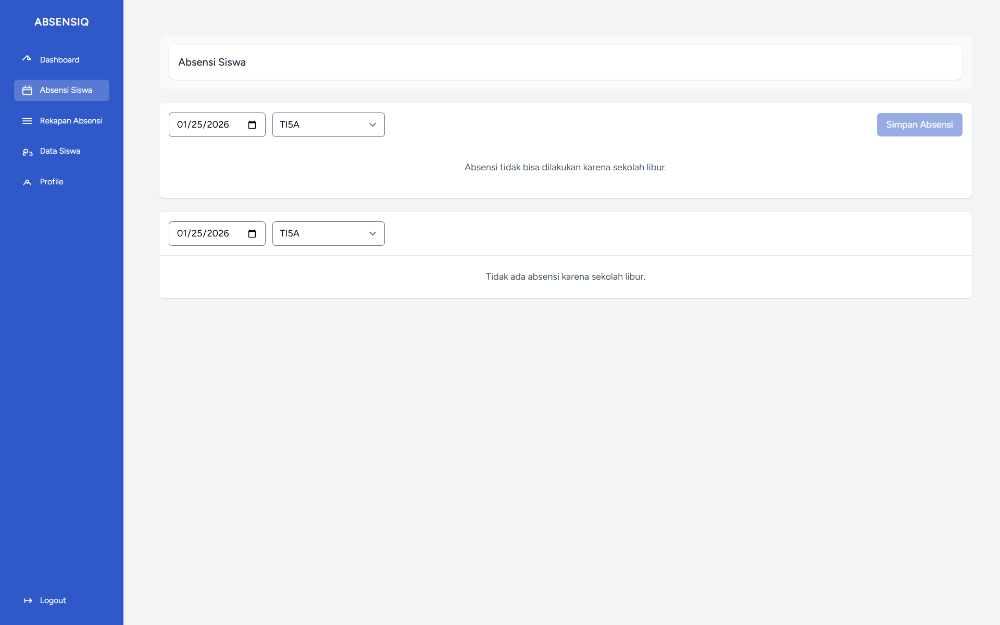

pencatatan kehadiran tidak bisa dilakukan ketika sekolah libur yaitu di hari minggu.

### Halaman Rekapan Kehadiran

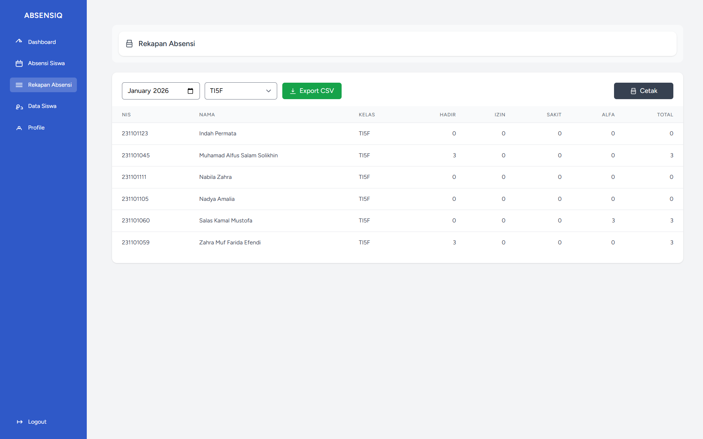

Tabel rekapan dengan filter tanggal dan kelas, menampilkan status kehadiran siswa dalam periode satu bulan.

### Halaman Cetak/Export Rekapan

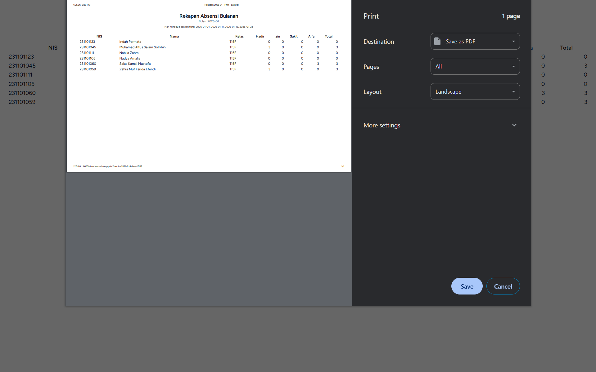

Halaman cetak PDF yang menampilkan rekapan kehadiran.

### Halaman Profil Pengguna

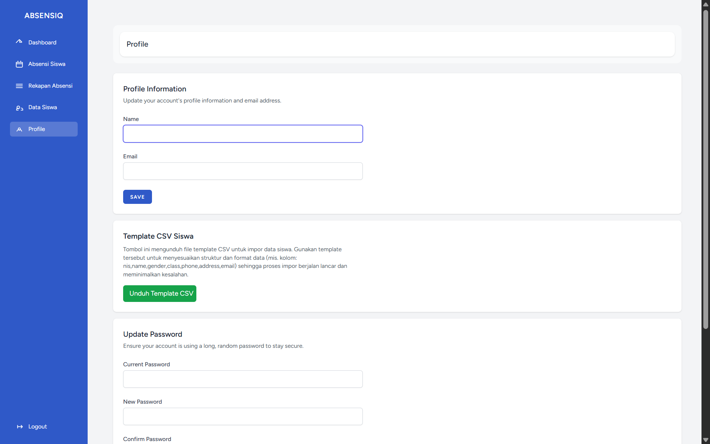

Halaman profil untuk menampilkan dan mengedit informasi pengguna.

### Halaman Profil - Ubah Password

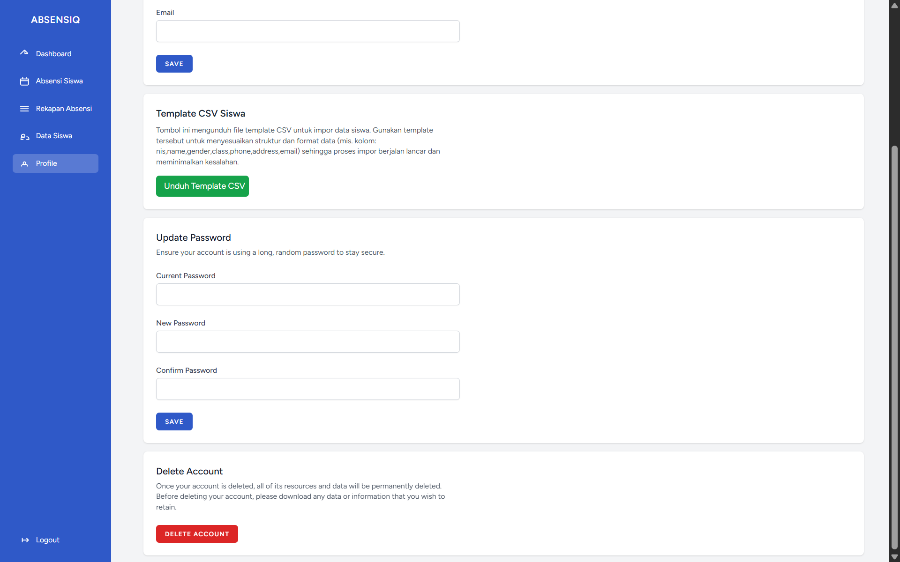

Form untuk mengganti password pengguna yang saat ini login.

## 🛠️ Teknologi yang Digunakan

### Backend

- **PHP 8.1+** - Bahasa pemrograman server-side
- **Laravel 10** - Framework web PHP yang powerful dan elegant
- **MySQL** - Database relasional untuk penyimpanan data
- **Laravel Sanctum** - Autentikasi API dan token management

### Frontend

- **React 18** - Library JavaScript untuk UI interaktif
- **Inertia.js** - Bridging layer antara Laravel backend dan React frontend (tanpa REST API)
- **Tailwind CSS 3** - Utility-first CSS framework untuk styling
- **Chart.js 4** - Library untuk membuat grafik dan chart
- **React Chart.js 2** - Wrapper React untuk Chart.js
- **Vite 5** - Module bundler cepat untuk development dan production build

### Tools & Utilities

- **Composer** - Package manager untuk PHP dependencies
- **npm** - Package manager untuk JavaScript dependencies
- **PHPUnit** - Testing framework untuk unit tests
- **Laravel Artisan CLI** - Command-line interface untuk Laravel tasks
- **PostCSS & Autoprefixer** - CSS processing tools

### Database Schema

#### Tabel `students`

```
- id (Primary Key)
- nis (string, unique) - Nomor Induk Siswa
- name (string) - Nama Siswa
- email (string, nullable, unique)
- class (string, nullable) - Kelas
- phone (string, nullable)
- address (text, nullable)
- gender (string, nullable) - Jenis Kelamin (male/female)
- created_at, updated_at
```

#### Tabel `attendances`

```
- id (Primary Key)
- student_id (Foreign Key ke students)
- date (date, indexed)
- status (enum: present, absent, sick, permit) - Status kehadiran
- note (text, nullable) - Catatan
- created_at, updated_at
- UNIQUE constraint: (student_id, date) - Satu siswa hanya punya satu record per hari
```

#### Tabel `users`

```
- id (Primary Key)
- name (string)
- email (string, unique)
- password (string, hashed)
- email_verified_at (timestamp, nullable)
- remember_token
- created_at, updated_at
```

## 📁 Struktur Folder Project

```
student-attendance/
├── app/
│   ├── Http/
│   │   ├── Controllers/
│   │   │   ├── AttendanceController.php      # Logic untuk mencatat & melihat kehadiran
│   │   │   ├── StudentController.php         # CRUD data siswa + import CSV
│   │   │   ├── DashboardController.php       # API untuk dashboard stats
│   │   │   └── ProfileController.php         # Manajemen profil pengguna
│   │   ├── Middleware/                       # Custom middleware
│   │   └── Requests/                         # Form validation requests
│   ├── Models/
│   │   ├── Student.php                       # Model siswa
│   │   ├── Attendance.php                    # Model kehadiran
│   │   └── User.php                          # Model pengguna
│   └── Providers/
├── resources/
│   ├── js/
│   │   ├── Pages/
│   │   │   ├── Dashboard.jsx                 # Halaman dashboard dengan charts
│   │   │   ├── Students/
│   │   │   │   ├── Index.jsx                 # Daftar siswa
│   │   │   │   ├── Create.jsx                # Form tambah siswa
│   │   │   │   └── Edit.jsx                  # Form edit siswa
│   │   │   └── Attendances/
│   │   │       ├── Index.jsx                 # Pencatatan kehadiran
│   │   │       ├── Rekap.jsx                 # Rekapan kehadiran
│   │   │       └── RekapPrint.jsx            # Cetak rekapan
│   │   ├── Components/                       # Reusable React components
│   │   ├── Layouts/                          # Layout components
│   │   └── app.jsx                           # Entry point React
│   ├── css/
│   │   └── app.css                           # Global styles
│   └── views/                                # Blade templates (minimal)
├── routes/
│   ├── web.php                               # Web routes utama
│   └── auth.php                              # Authentication routes
├── database/
│   ├── migrations/                           # Database schema migrations
│   ├── seeders/                              # Database seeders
│   └── factories/                            # Model factories untuk testing
├── tests/
│   ├── Feature/                              # Feature tests
│   └── Unit/                                 # Unit tests
├── public/                                   # File publik (assets, index.php)
├── config/                                   # Konfigurasi aplikasi
├── bootstrap/                                # Bootstrap files
├── storage/                                  # File storage (logs, uploads)
├── vendor/                                   # PHP dependencies (via Composer)
├── node_modules/                             # JavaScript dependencies (via npm)
├── package.json                              # NPM dependencies & scripts
├── composer.json                             # PHP dependencies & scripts
├── vite.config.js                            # Vite configuration
├── tailwind.config.js                        # Tailwind CSS configuration
├── phpunit.xml                               # PHPUnit configuration
└── .env                                      # Environment variables (DB, APP_KEY, dll)
```

## 🚀 Cara Menjalankan Project

### Prasyarat

Pastikan sudah terinstall:

- **PHP 8.1+** ([Download](https://www.php.net/downloads))
- **Composer** ([Download](https://getcomposer.org/download/))
- **Node.js & npm** ([Download](https://nodejs.org/))
- **MySQL** atau database lainnya ([Download](https://www.mysql.com/downloads/))

### Langkah-Langkah Instalasi

#### 1. Clone Repository

```bash
git clone <repository-url>
cd student-attendance
```

#### 2. Install PHP Dependencies

```bash
composer install
```

#### 3. Setup Environment

Salin file `.env.example` ke `.env`:

```bash
cp .env.example .env
```

Edit file `.env` dan konfigurasi database:

```
DB_CONNECTION=mysql
DB_HOST=127.0.0.1
DB_PORT=3306
DB_DATABASE=student_attendance
DB_USERNAME=root
DB_PASSWORD=
```

Generate application key:

```bash
php artisan key:generate
```

#### 4. Setup Database

Jalankan migrasi dan seeder:

```bash
php artisan migrate --seed
```

Ini akan membuat tabel-tabel dan mengisi data awal (siswa, kehadiran, user).

#### 5. Install JavaScript Dependencies

```bash
npm install
```

#### 6. Build Assets (Development)

```bash
npm run dev
```

Ini akan menjalankan Vite dev server dengan hot module replacement untuk development.

Untuk production build:

```bash
npm run build
```

#### 7. Jalankan Development Server

Di terminal baru, jalankan Laravel server:

```bash
php artisan serve
```

Aplikasi akan berjalan di `http://localhost:8000`

#### 8. Login

Gunakan akun admin yang sudah di-seed:

- **Email**: `admin01@example.com`, `admin1@example.com`, atau `adminsatu@example.com`
- **Password**: `87654321`

### Running Tests

```bash
php artisan test
```

Atau test file tertentu:

```bash
php artisan test tests/Feature/StudentsPaginationTest.php
```

## 📋 Catatan Tambahan

### Fitur Yang Sudah Diimplementasikan

✅ Dashboard dengan charts dan per-class stats  
✅ CRUD siswa lengkap  
✅ Import siswa dari CSV  
✅ Export rekapan ke Excel  
✅ Cetak rekapan PDF  
✅ Pencatatan kehadiran per-kelas  
✅ Filter dan pencarian siswa  
✅ Validasi input di form  
✅ Autentikasi dan manajemen profil  
✅ Pendeteksian hari libur (Minggu) otomatis  
✅ Notifikasi sukses untuk setiap action  
✅ Paginasi dengan nomor urut berkelanjutan  
✅ Responsive design dengan Tailwind CSS

### Rencana Pengembangan & Fitur Masa Depan

- [ ] Tambah role/permission system (admin, guru, wali murid)
- [ ] Wali murid bisa melihat kehadiran anak mereka
- [ ] SMS/Email notification untuk orang tua
- [ ] Import data siswa dari sistem sekolah lain
- [ ] Analitik lanjutan (tren absensi, prediksi dropout)
- [ ] Multi-sekolah support
- [ ] Mobile app (React Native)
- [ ] API REST untuk integrasi pihak ketiga

### Known Limitations

- Sistem belum mendukung multiple sessions pengguna
- Export PDF dan Excel hanya bisa untuk tanggal/kelas spesifik (bulk export belum ada)
- Dashboard stats dihitung real-time (untuk data sangat besar mungkin perlu caching)

### Database Credentials Template

Jika menggunakan fresh MySQL:

```sql
CREATE DATABASE student_attendance;
CREATE USER 'laravel'@'localhost' IDENTIFIED BY 'password';
GRANT ALL PRIVILEGES ON student_attendance.* TO 'laravel'@'localhost';
FLUSH PRIVILEGES;
```

Kemudian update `.env`:

```
DB_USERNAME=laravel
DB_PASSWORD=password
```

### Helpful Commands

```bash
# Clear cache
php artisan cache:clear
php artisan config:clear

# Reset database (hapus semua data & jalankan ulang migrations)
php artisan migrate:fresh --seed

# Generate dummy data
php artisan tinker
>>> App\Models\Student::factory()->count(50)->create();
>>> App\Models\Attendance::factory()->count(200)->create();

# View all routes
php artisan route:list

# Check Laravel version
php artisan --version
```

## 📞 Support & Kontribusi

Untuk pertanyaan atau masalah, silakan buka issue di repository atau hubungi tim development.

---

**Last Updated**: Januari 2026  
**Project Status**: Active Development  
**License**: MIT
